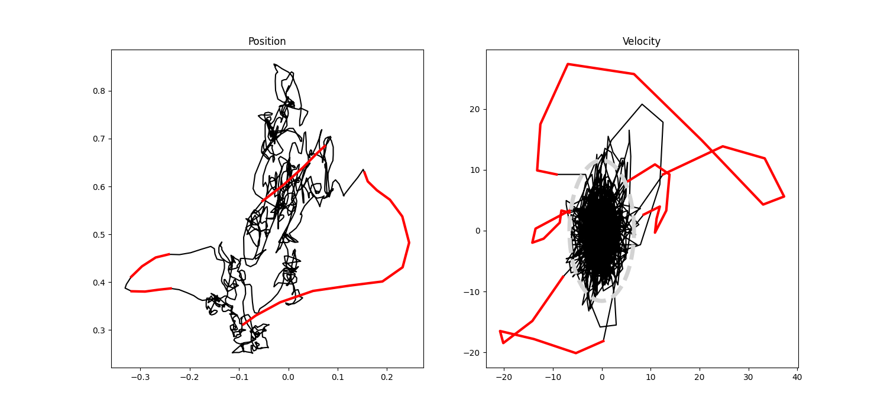

# Microsaccade Toolbox for Python
### Algorithm Authors: Ralf Engbert, Petra Sinn, Konstantin Mergenthaler, Hans Trukenbrod; Affiliation: University of Potsdam, Germany
### Python translation by Lisa Schwetlick and Paul Schmitthäuser; University of Potsdam

## Description
The Microsaccade Toolbox is a collection of functions to analyze fixational eye movements based on data recorded via high-resolution (>200 Hz) eye-tracking. The topics implemented in this python implementation are the same as in the original R implementation that can be found [here](http://read.psych.uni-potsdam.de/index.php?option=com_content&view=article&id=140:engbert-et-al-2015-microsaccade-toolbox-for-r&catid=26:publications&Itemid=34): 
- detection of microsaccades
- statistical analysis using surrogate data
- random-walk analysis of fixational eye movements

Microsaccade detection is based on an algorithm that implements a velocity threshold to identify (micro)saccades in eye-tracking traces [1–3].

Statistical tests of microsaccade detection can be performed against phase-randomized surrogate data [4] to evaluate the reliability of the detection threshold and data quality. For more general statistical properties of fixational eye movements, random-walk [5, 6] and box-count [2] analyses are implemented to investigate the interaction between slow fixational eye movements (drift) with microsaccades.

## References
- [1] Engbert, R., & Kliegl, R. (2003). Microsaccades uncover the orientation of covert attention. Vision Research, 43, 1035–1045.
- [2] Engbert, R., & Mergenthaler, K. (2006). Microsaccades are triggered by low retinal image slip. Proceedings of the National Academy of Sciences of the U.S.A., 103, 7192–7197.
- [3] Engbert, R. (2006). Microsaccades: A microcosm for research on oculomotor control, attention, and visual perception. Progress in Brain Research, 154, 177–192.
- [4] Theiler, J., Eubank, S., Longtin, A., Galdrikian, B., & Farmer, J. D. (1992). Using surrogate data to detect nonlinearity in time series. In: Casdagli, M., & Eubank, S. (Eds.) Nonlinear Modeling and Forecasting. (Boulder: Westview Press; Santa Fe Institute Series, Vol. 12; pp. 163–188).
- [5] Engbert, R., & Kliegl, R. (2004). Microsaccades keep the eyes' balance during fixation. Psychological Science, 15, 431–436.
- [6] Collins, J. J., & De Luca, C. J. (1993). Open-loop and closed-loop control of posture: A random-walk analysis of center-of-pressure trajectories. Experimental Brain Research, 95, 308–318.